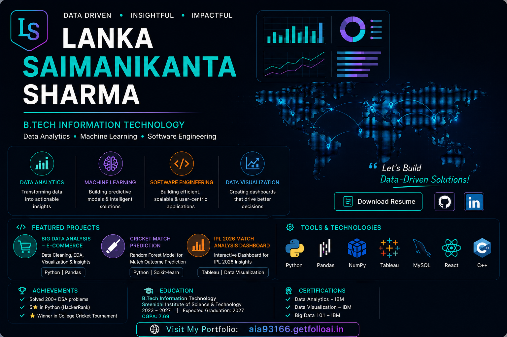

# 👋 Hi, I'm Lanka Saimanikanta Sharma

### B.Tech Information Technology Student

📊 Data Analytics | 🤖 Machine Learning | 💻 Software Engineering

🌐 **[Visit My Portfolio](https://aia93166.getfolioai.in)**

💼 **[LinkedIn](https://www.linkedin.com/in/saimanikanta-sharma-33b14a307/)**

🐙 **[GitHub](https://github.com/lankasaimanikanta2005-jpg)**

---

## 🚀 Featured Projects

### 📊 Big Data Analysis – E-Commerce
Python | Pandas | NumPy | Data Analytics

### 🏏 Cricket Match Prediction using Random Forest
Python | Scikit-learn | Machine Learning

### 📈 IPL 2026 Match Analysis Dashboard
Tableau | Data Visualization | Cricket Analytics

---

## 🛠️ Skills

Python • C • C++ • Pandas • NumPy • Tableau • React • Machine Learning • Data Analytics
